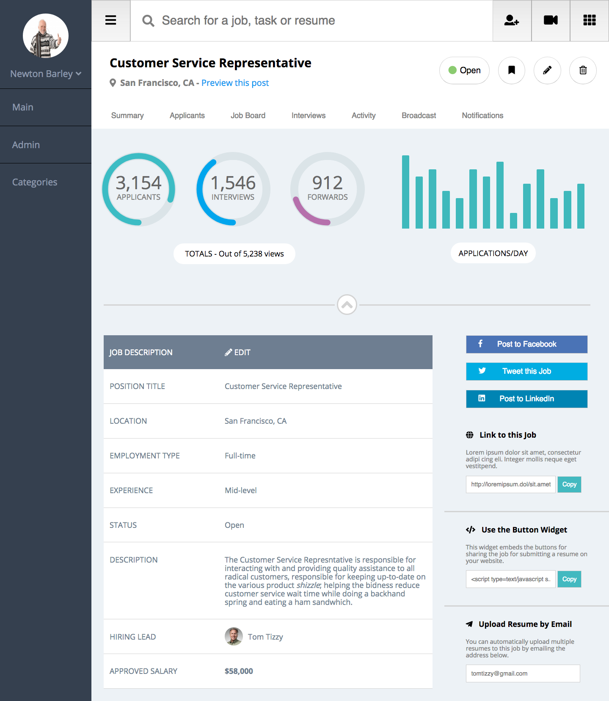
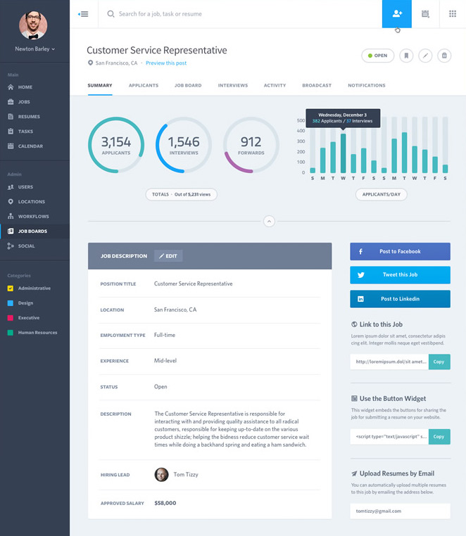

# cy-comp-challenge-3
1711 FE MOD1 Static Comp Challenge 3

In each challenge we are asked to recreate a static comp with the objective to build something that respects the integrity of the original design to reflect the designer’s choice in layout, spacing, font, imagery, and color to the smallest detail.

We were not provided with any assets, nor native files. We have not been provided breakpoint specific comps. We may NOT take liberties with the layout, but our creative license includes: Copy, Images, Icons, and Color palette, but ONLY if we select a complementary palette.

This is my static-comp:

This is the provided static-comp:

